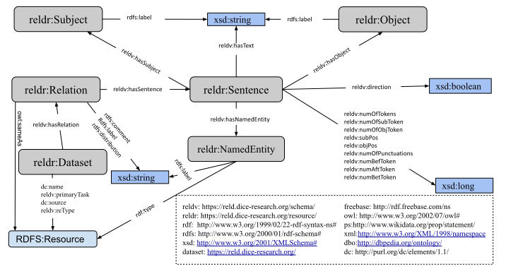

# RELD: A Knowledge Graph of Relation Extraction Datasets
RDFizing relation extraction datasets and benchmarking relations and sentences.

## Documentation


### Conversion to RDF

The script can be used to generate the RDF of a single dataset individually or at once for all datasets (The process will take a few hours to complete for all the datasets at once)
### Prerequisites
The required packages for running the script will be installed by running the following command:
```
 pip install -r requirements.txt
```

#### Single dataset conversion
To convert a single dataset, you can run the individual script as follow:

```
  # For SemEval 2010 Task 8 Dataset
  python semEval.py
  
  # For Google Relation Extraction Dataset
  python google.py
  
  # For Wikipedia-Wikidata Dataset
  python wikiRE.py
  
  # For WEBNLG Dataset
  python webNlg.py
  
  # For FewRel Dataset
  python few_rel.py
  
  # For NYT-FB Dataset
  python nyt.py
  
```
The .ttl output will be saved in the respective folders inside the output folder

<b>Note:</b> The datasets files must be in the respective folders inside the data folder, otherwise, you need to set the path variable inside each script. 

#### Conversion at once for all six datasets
To convert all the datasets at once, you need to run the following command:

```
 python main.py 
```
<hr>

### Datasets used

| *Dataset*   | *Download*  |
|-------------|-----------|
|Wikipedia_Wikidata|[Download](https://www.informatik.tu-darmstadt.de/ukp/research_6/data/lexical_resources/wikipedia_wikidata_relations/)|
|SemEval 2010 Task 8|[Download](http://www.kozareva.com/downloads.html)|
|WEBNLG|[Download](https://webnlg-challenge.loria.fr/)|
|Google RE|[Download](https://github.com/google-research-datasets/relation-extraction-corpus)|
|FewRel|[Download](https://www.zhuhao.me/fewrel/)|
|NYT-FB|[Download](http://iesl.cs.umass.edu/riedel/ecml/)|

<hr>

### Dumps
The generated dumps in compressed form are available online [here](https://hobbitdata.informatik.uni-leipzig.de/RELD/)

<hr>

### Overview of RELD Framework


<hr>


### Authors
  * [Manzoor Ali](https://dice-research.org/ManzoorAli) (DICE, Paderborn University) 
  * [Muhammad Saleem](https://sites.google.com/site/saleemsweb/) (AKSW, University of Leipzig) 
  * [Axel-Cyrille Ngonga Ngomo](https://dice-research.org/AxelCyrilleNgongaNgomo) (DICE, Paderborn University)

## License
The source code of this repo is published under the [Apache License Version 2.0].

